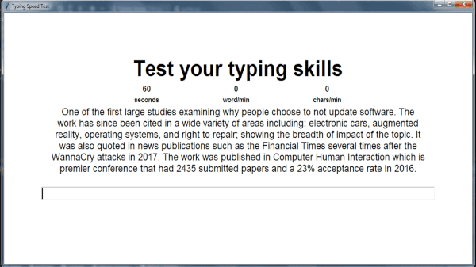

## Typing Speed Test

Desktop app to assess your typing seed, this app was building using tkinter

The  is 41 words per minute,
but with practice, you can speed up to 100 words per minute.

<h2 align="center">
  
</h2>